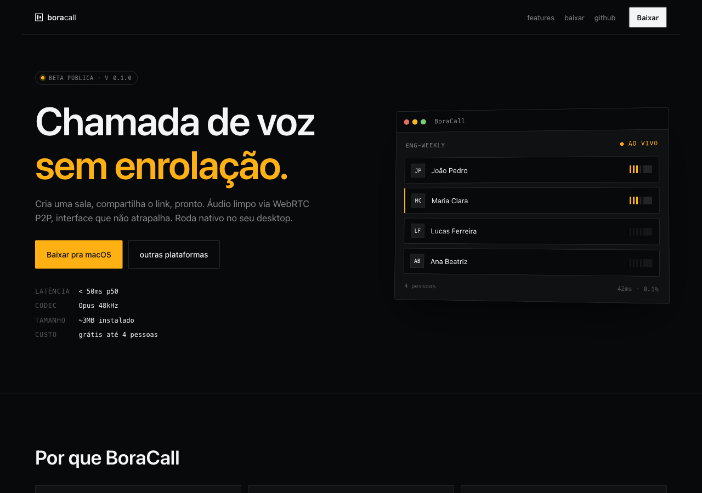
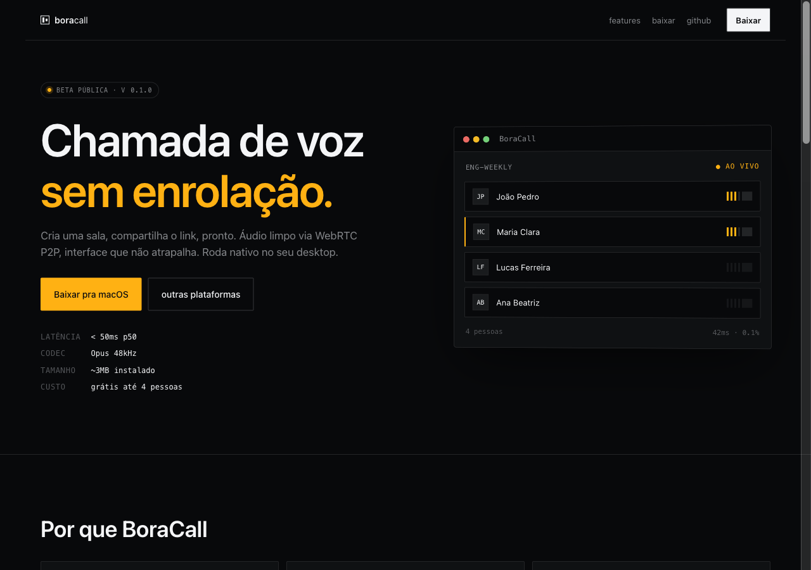
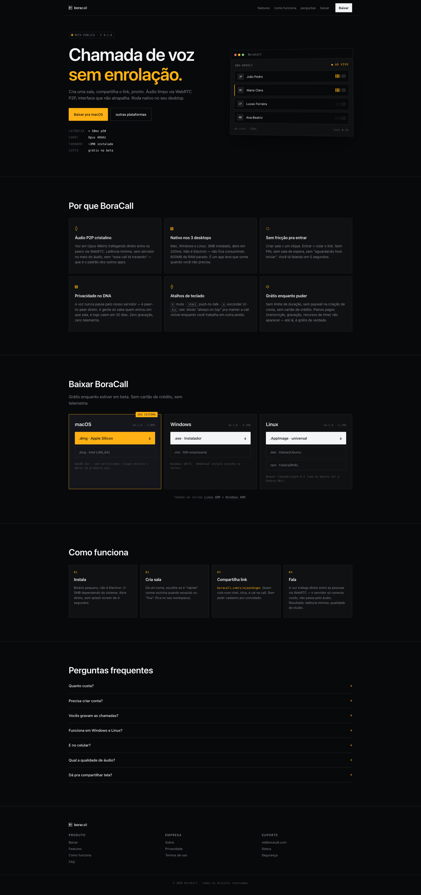

<div align="center">


# BoraCall

**Chamadas de voz em grupo, leves, sem enrolação — desktop nativo cross-platform.**

Tauri v2 · Rust (axum + sqlx) · Postgres 16 · WebRTC mesh · React 18 (sem build step)

[](./LICENSE)


[Arquitetura](#arquitetura) · [Stack](#stack) · [Highlights](#highlights-de-engenharia) · [Rodando local](#rodando-local) · [Roadmap](#roadmap) · [Contribuindo](./CONTRIBUTING.md)

</div>

<br/>

<p align="center">
  
</p>

---

## Sobre

BoraCall é um app de **servidores com canais de texto e de voz** — o modelo do Discord, num app nativo de 3 MB em vez de um navegador inteiro. A conversa fica organizada por canal, e o áudio vai **direto entre os peers** via WebRTC: o servidor só faz *signaling*, nunca toca o áudio.

O projeto nasceu como um exercício pessoal de **arquitetura full-stack em Rust** com um cliente **desktop multiplataforma** embarcando um frontend web (React 18 via CDN + Babel standalone, zero build step) dentro de um shell **Tauri v2**. O mesmo binário roda em macOS, Windows e Linux — o webview é o nativo de cada plataforma (WKWebView / WebView2 / WebKitGTK).

> Em uma frase: **um Discord enxuto, open source, com server stateless em Rust e mesh P2P real.**

---

## Highlights de engenharia

O que torna este projeto interessante para um portfolio:

| Área | Decisão | Por quê |
|------|---------|---------|
| **Backend** | Rust + axum 0.8 + sqlx (compile-time checked SQL) | Zero ORM magic; queries validadas contra Postgres vivo no build. |
| **Allocator** | `tikv-jemallocator` como `#[global_allocator]` em prod | Glibc malloc vaza sob carga WebSocket de longa duração. |
| **Signaling** | uma conexão WebSocket por servidor, com `tokio::sync::broadcast`; presença de voz segmentada por canal | Quem está no app precisa de texto de todos os canais e presença de todos os de voz ao mesmo tempo — uma conexão por canal seria N por usuário. |
| **Auth WS** | JWT via `Sec-WebSocket-Protocol: token.<jwt>` — **não** via query string | Query params vazam em logs de proxy, histórico de browser e métricas. |
| **Senhas** | Argon2id (OWASP primary) com salt por usuário | `m_cost=19MB, t_cost=2` — balanceado pra server moderno. |
| **Canais** | Slug de 5 chars sem caracteres ambíguos (`0/O`, `1/l/I`), único global | É ele que vira o link de convite: `/c/<slug>` resolve sozinho, sem o slug do servidor junto. |
| **Glare avoidance** | Peer com `user_id` lexicográfico menor cria o offer | Determinístico, sem handshake extra pra decidir quem inicia. |
| **Mesh cap** | `BC_MAX_PEERS_PER_CHANNEL` default 6, por canal de voz | Acima de ~4 falando o mesh satura o uplink — guarda-corpo até existir SFU. |
| **Desktop** | Tauri v2 com auto-updater ed25519-signed | `.dmg` + `.msi` + `.AppImage/.deb/.rpm` gerados em 4 runners paralelos no CI. |
| **Linux quirk** | Intercepta `PermissionRequest` do webkit2gtk pra liberar mic | WebKitGTK nega `getUserMedia` por padrão — hook nativo no `setup()` do Tauri. |
| **Sem build step** | React 18 + Babel standalone via `<script>`, fontes vendoradas | Frontend é copiado pro binário Tauri; edita JSX, reload, pronto. |

<p align="center">
  
</p>

---

## Stack

### Backend (`server/`)
- **axum 0.8** — routing, extractors, WebSocket
- **sqlx 0.8** (Postgres, runtime-tokio, rustls) — compile-time checked queries
- **argon2 + jsonwebtoken** — hash + JWT HS256
- **dashmap + parking_lot** — presence map lock-free
- **tower-http** — compression, timeout, trace, CORS
- **resend-rs** — e-mail transacional (OTP + password reset)
- **tikv-jemallocator** — global allocator em prod

### Desktop (`src-tauri/`)
- **Tauri v2** com plugins `clipboard-manager`, `opener`, `updater`
- **webkit2gtk** (Linux only) para hook de permissão de mic
- Bundle nativo: `.dmg`, `.app`, `.msi`, `.exe`, `.AppImage`, `.deb`, `.rpm`

### Frontend (`dist/`)
- **React 18.3** + **Babel standalone** (CDN vendorado, zero toolchain)
- `window.api` / `window.Realtime` / `window.WebRTCMesh` / `window.desktop` — quatro módulos globais limpos
- Inter + JetBrains Mono vendoradas — zero requisição de rede no boot

### Banco
- **Postgres 16-alpine** com extensões `uuid-ossp`, `pgcrypto`, `citext`
- Migrações SQL em `server/migrations/`, pool dimensionado como `4 × CPU` com clamp `8..64`

---

## Arquitetura

```
  ┌─────────────────┐    1️⃣  HTTPS /api/*     ┌──────────────────────┐
  │                 │ ─────────────────────→ │                      │
  │  BoraCall.app   │    2️⃣  WS /ws/servers/:s │  boracall-server     │
  │  Tauri v2       │ ═══════════════════════│  axum + tokio        │
  │  ├─ webview     │   signaling (SDP/ICE)  │  jemalloc            │
  │  │  React 18    │   presence, mute       │  ├─ Hub (DashMap)    │
  │  └─ Rust core   │                        │  └─ sqlx pool        │
  └─────────────────┘                        └──────────────────────┘
         ▲ ▲                                           │
         │ │        3️⃣  RTP/SRTP peer-to-peer        ▼
         │ └─── direto com outro peer ───┐   ┌─────────────────────┐
         │                               ▼   │   Postgres 16       │
         │                 ┌─────────────────┐│   users             │
         └──────────────── │  Outro peer     ││  servidores, canais │
                           │  BoraCall.app   ││   memberships       │
                           └─────────────────┘│   call_events (log) │
                                              └─────────────────────┘
```

- **O servidor só relaya metadados** (SDP / ICE / presença). **O áudio é P2P.**
- Até ~4 pessoas fecha mesh bem (6 conexões RTCPeerConnection, latência ótima). Acima disso entra SFU (LiveKit/mediasoup).
- `Hub` é in-memory (single-node). Pra multi-nó, ver seção *Escala horizontal* no [ARCHITECTURE.md](./ARCHITECTURE.md).

Diagramas de sequência (signup+OTP, criação de servidor e canal, handshake de mesh) estão em **[ARCHITECTURE.md](./ARCHITECTURE.md)**.

---

## Rodando local

**Pré-requisitos:** Rust ≥1.77, Node ≥20, Docker (ou Colima no macOS).

```bash
# 1) Clona e entra
git clone https://github.com/<seu-user>/BoraCall && cd BoraCall
cp .env.example .env   # ajuste BC_JWT_SECRET ao menos

# 2) Sobe o Postgres (dev-only, tuning agressivo — NÃO usar em prod)
docker compose up -d    # ou: colima start --cpu 4 --memory 4 && docker compose up -d

# 3) Roda o backend
cargo run -p boracall-server --release

# 4) Em outro terminal — modo dev com hot reload
npm install
npm run dev             # abre o app Tauri apontando pra localhost:3030
```

**Testar uma chamada na mesma máquina** (duas janelas independentes):
```bash
# depois de `npm run build`:
for i in 1 2; do open -n src-tauri/target/release/bundle/macos/BoraCall.app; done
```

Cada janela faz signup com um e-mail diferente, uma cria servidor, copia o link do canal (`boracall.com/c/<slug>`), a outra cola em *"Entrar por link"* e a voz flui via WebRTC loopback.

**Documentação operacional completa**: ARCHITECTURE.md (deploy em VPS, systemd unit, nginx TLS, TURN, backup, code-signing).

---

## Estrutura do repo

```
BoraCall/
├── Cargo.toml                  # workspace: server + src-tauri
├── docker-compose.yml          # Postgres 16 tunado pra dev
├── .env.example
├── README.md  ARCHITECTURE.md  CONTRIBUTING.md  SECURITY.md  LICENSE
│
├── dist/                       # frontend embedado no binário Tauri
│   ├── index.html              # 1 página só, carrega tudo por <script>
│   ├── env.js                  # window.BC_API_URL — sobrescreve no deploy
│   ├── api.js                  # REST client (fetch + JWT localStorage)
│   ├── realtime.js             # WebSocket reconectável
│   ├── webrtc.js               # mesh manager (RTCPeerConnection per peer)
│   ├── desktop-bridge.js       # shims nativos (window.desktop)
│   ├── app.jsx                 # router + estado global + auth boot
│   ├── screens-{1,2}.jsx       # telas (landing, auth, servidores, chat, call)
│   └── vendor/                 # React 18 + Babel + fontes
│
├── server/                     # backend Rust
│   ├── migrations/0001_initial.sql
│   └── src/
│       ├── main.rs             # bootstrap + rotas + graceful shutdown
│       ├── config.rs           # env-driven (BC_BIND, DATABASE_URL, ...)
│       ├── auth.rs             # JWT + argon2 + AuthUser extractor
│       ├── signaling.rs        # Hub<DashMap<slug, broadcast>> + WS handler
│       ├── otp.rs email.rs     # OTP TTL in-memory + Resend
│       ├── handlers/           # auth, servers, messages, ice, system
│       └── error.rs state.rs db.rs
│
├── src-tauri/                  # shell desktop
│   ├── tauri.conf.json         # bundle cross-platform + updater endpoint
│   ├── Info.plist              # NSMicrophoneUsageDescription + boracall://
│   └── src/{main,lib}.rs       # platform_info, window_*, updater
│
├── landing/                    # landing page estática (deploy separado)
└── .github/workflows/
    ├── release.yml             # tag v*.*.* → 4 runners → GH Release draft
    └── landing.yml             # push em landing/ → rsync pro VPS
```

---

## Features implementadas

**Real e funcional:**
- ✅ Auth completo (signup/login/me/update) — Postgres + argon2id + JWT
- ✅ OTP real via Resend com TTL de 10min in-memory
- ✅ Password reset end-to-end (request + token + reset)
- ✅ Rooms CRUD com slug único, lock por senha (argon2id), membership
- ✅ Signaling WebSocket com subprotocol auth e per-room broadcast hub
- ✅ WebRTC mesh funcional com glare avoidance determinístico
- ✅ Presence em tempo real (joined/left/mute/speaking)
- ✅ Auto-updater Tauri v2 com assinatura ed25519 + endpoint próprio
- ✅ Cap de peers por canal de voz (DoS de topologia mesh)
- ✅ CI/CD: 4 runners paralelos gerando `.dmg` (ARM+Intel), `.msi`, `.AppImage`/`.deb`/`.rpm`
- ✅ Landing page estática auto-deployada via GitHub Actions + rsync

<p align="center">
  
</p>

---

## Roadmap

Antes de considerar "prod-ready":

- [x] **TURN server** (coturn) — quem está atrás de NAT simétrica agora conecta
- [x] **Rate limiting** por IP e por e-mail de destino
- [x] **Testes** — unitários, integração com Postgres, e smoke de voz num navegador real
- [x] **Deploy automatizado** do backend, com rollback e healthcheck
- [ ] **Refresh tokens** — hoje o JWT tem validade fixa de 30 dias, sem revogação
- [ ] **SFU opcional** pra chamada com mais de ~6 pessoas por canal
- [ ] **Deep link** `boracall://c/<slug>` — scheme registrado, handler falta
- [ ] **OAuth Google**
- [ ] **Code-signing**: Developer ID Apple + cert EV Windows
- [ ] **Observabilidade estruturada** (OpenTelemetry)
- [ ] **Backup automatizado** do Postgres

Escala horizontal (trait `SignalBus`, sticky sessions no LB, presença em NATS KV)
está mapeada no [ARCHITECTURE.md](./ARCHITECTURE.md#escala-horizontal).

---

## Contribuindo

Issues com a etiqueta [`good first issue`](https://github.com/sirelves/boracall/labels/good%20first%20issue)
são o melhor ponto de partida — escopo fechado, com o arquivo e a abordagem
indicados no corpo.

- [CONTRIBUTING.md](./CONTRIBUTING.md) — como rodar, convenções e o que verificar antes do PR
- [SECURITY.md](./SECURITY.md) — como relatar vulnerabilidade (nunca em issue pública)
- [CODE_OF_CONDUCT.md](./CODE_OF_CONDUCT.md)


O projeto é open source sob **MIT**. Abra uma issue antes de mandar PR grande — adoro ideias mas não quero te fazer perder tempo. Detalhes em [CONTRIBUTING.md](./CONTRIBUTING.md).

Áreas que agradecem ajuda:
- QA de Windows e Linux (os codecs de WebRTC variam por webview)
- SFU, pra chamada com mais de ~6 pessoas por canal
- Tradução (hoje só PT-BR)
- Acessibilidade (leitor de tela no fluxo de chamada)

---

## Licença

[MIT](./LICENSE) © 2026 Elves S.

---

<div align="center">
<sub>Feito com 🦀 Rust, 🔥 Tauri e um ódio saudável por reuniões longas.</sub>
</div>
